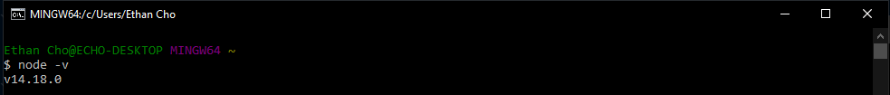

# Homework-9-README-Generator 

## Table of Contents
1. [Description](#description) <br>
2. [Installation](#installation) <br>
3. [Usage](#usage)<br>
4. [License](#license)<br>
5. [Contributing](#contributing)<br>
6. [Built Using](#built-using)<br>

## Description

This application asks the user questions regarding their project using inquirejs. It then uses the user inputs and generates a README.md for their project.

## Installation

Make sure you have node.js installed:<br>

<br>Initialize the package.json by running the command:<br>
```shell
npm init
```
Once node is installed and you've initialized the package.json, you install inquirer.js: <br>
```shell
npm i inquirer
```

## Usage

[Demo Video](https://watch.screencastify.com/v/O1KMX9ZTTqCfveB07x2j)

## License

[License](https://choosealicense.com/licenses/mit/)

## Contributing

Anyone is more than welcome to open a pull request or an issue if they would like to. 

## Built Using

inquirer.js: [inquirer](https://www.npmjs.com/package/inquirer)<br>
node.js: [node](https://nodejs.org/en/)<br>
javascript